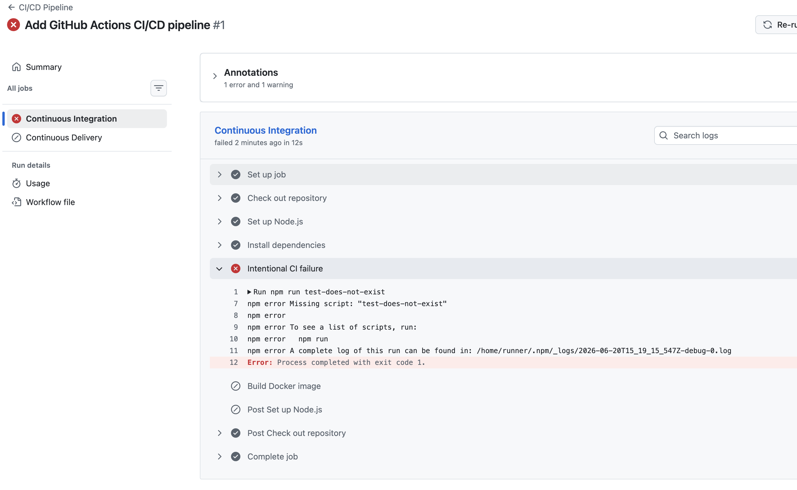
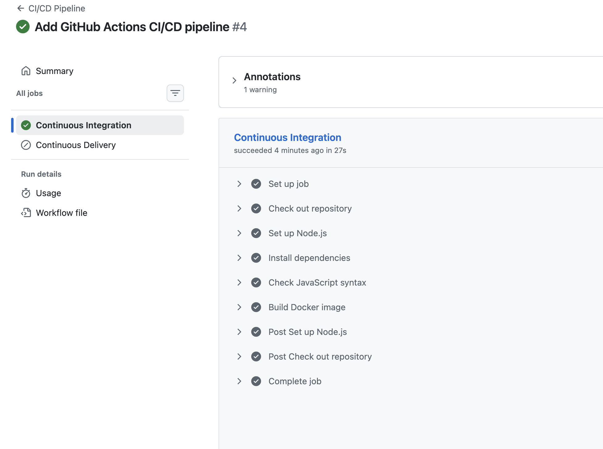
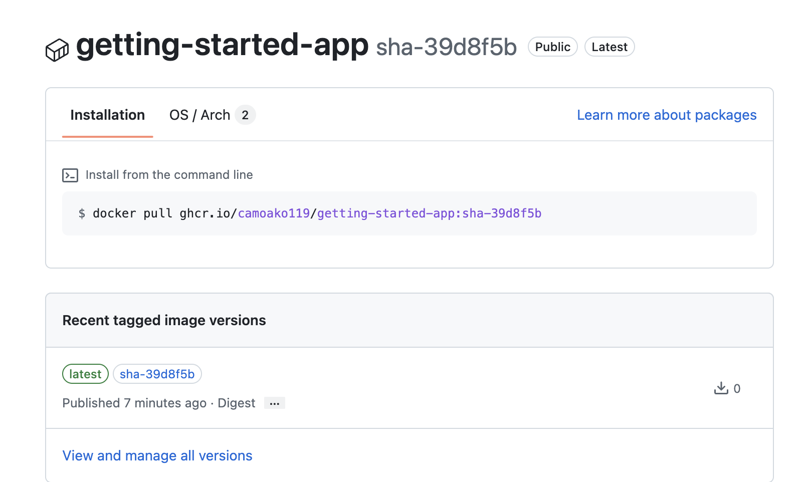
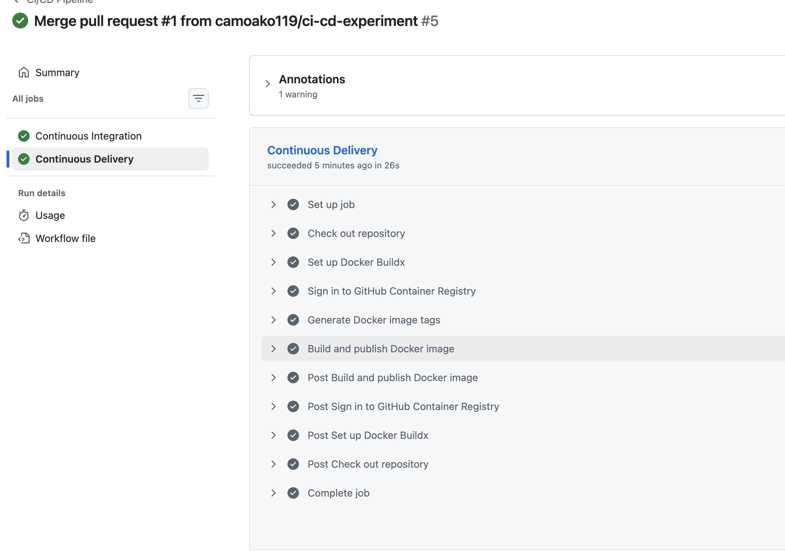

# Getting started

This repository is a sample application for users following the getting started guide at https://docs.docker.com/get-started/.

The application is based on the application from the getting started tutorial at https://github.com/docker/getting-started

## GitHub Actions CI/CD Experiment

This project uses GitHub Actions to automate continuous integration and continuous delivery for the Dockerized Node.js todo application.

### Continuous Integration

The CI job runs for pull requests targeting the `main` branch and for pushes to `main`. It performs the following steps:

1. Checks out the repository.
2. Configures Node.js.
3. Installs dependencies using `npm ci`.
4. checks the JavaScript source files for syntax errors.
5. Builds the application Docker image.

### Continuous Delivery

After the CI job passes on the `main` branch, the CD job:

1. Configures Docker Buildx.
2. Authenticates with GitHub Container Registry using `GITHUB_TOKEN`.
3. Builds the Docker image.
4. Publishes the image to GitHub Container Registry.
5. Creates both a `latest` tag and a commit-SHA tag.

### CI/CD Experiment

To experiment with GitHub Actions, I initially added an invalid npm command:

```bash
npm run test-does-not-exist
find src -name "*.js" -print0 | xargs -0 -n1 node --check

Also, the Dockerfile and compose.yaml files were not pushed to the branch
which caused it to fail

After pushing the correction, the continuous integration workflow passed. I then merged the pull request into main, which triggered the continuous delivery job and published the Docker image to GitHub Container Registry.

### Task 5 Screenshot








